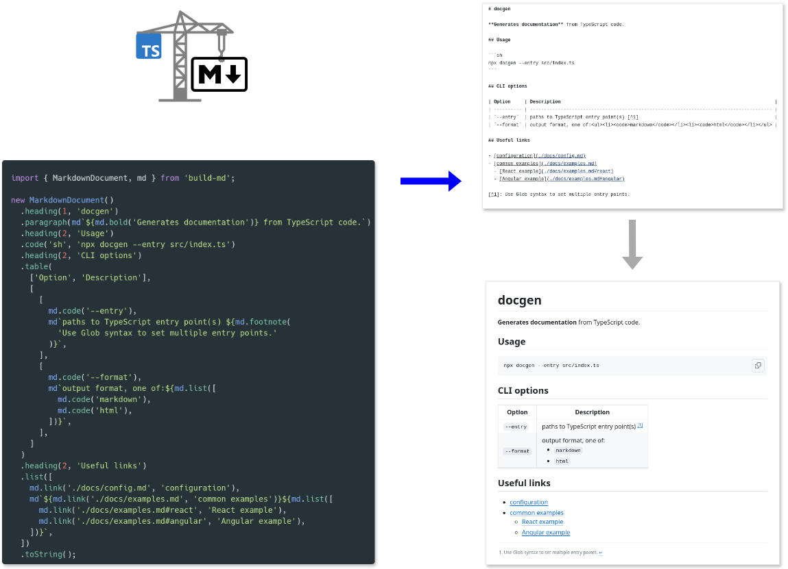

# build-md

[](https://www.npmjs.com/package/build-md)
[](https://github.com/matejchalk/build-md/actions/workflows/ci.yml?query=branch%3Amain)
[](https://codecov.io/github/matejchalk/build-md)

Comprehensive **Markdown builder** for JavaScript/TypeScript.



📖 Full documentation is hosted at <https://matejchalk.github.io/build-md/>.

## Key features

- ⌨️ Its **intuitive syntax** makes it convenient for generating Markdown from JavaScript/TypeScript code.
  - _Builder pattern_ used for creating Markdown documents.
  - _Tagged template literal_ used for inline Markdown formatting and nesting Markdown blocks.
- 🖺 Has **comprehensive support** for many commonly used Markdown elements.
  - All elements from Markdown's [basic syntax](https://www.markdownguide.org/basic-syntax/) are included.
  - Also supports many elements from [extended syntax](https://www.markdownguide.org/extended-syntax/) (e.g. from [GitHub Flavored Markdown](https://github.github.com/gfm/)).
- 📑 Enables **logical nesting** of Markdown elements and uses **contextual rendering** to ensure output will be rendered correctly.
  - Blocks may contain inline elements or even other blocks (e.g. nested lists), inline elements may contain other inline elements, etc.
  - Each element may be rendered as HTML instead of Markdown if needed. For example, block elements in Markdown tables will automatically render using equivalent HTML tags. And if a parent element is rendered as HTML, so will all its children.
- 🧮 Document builder enables writing **conditional and iterative logic** in a declarative way.
  - Falsy values from regular JavaScript expressions are ignored.
  - Special methods provided for adding multiple related elements conditionally or in a loop.
  - Even for very complex dynamic documents, there should be no need to resort to imperative logic like `if`/`else` branches or `for` loops. But if you prefer this coding style, then its supported in mutable mode (immutable is default).
- 🎀 Markdown output is **well-formatted**.
  - Automatically inserts line breaks and indentation as appropriate. Even Markdown tables are aligned to be more readable.
  - No need to run additional tools like Prettier to have nicely formatted Markdown.

## Quickstart

Install `build-md` with your package manager in the usual way. E.g. to install as a dev dependency using NPM:

```sh
npm install -D build-md
```

Import the [`MarkdownDocument` class](https://matejchalk.github.io/build-md/classes/MarkdownDocument.html), add some basic Markdown blocks and render as string:

```js
import { MarkdownDocument } from 'build-md';

new MarkdownDocument()
  .heading(1, 'Contributing')
  .heading(2, 'Setup')
  .paragraph('Install dependencies with:')
  .code('sh', 'npm install')
  .heading(2, 'Development')
  .list([
    'npm test - run unit tests with Vitest',
    'npm run docs - generate documenation with TypeDoc',
  ])
  .toString();
```

To add inline formatting, import the [`md` tagged template literal](https://matejchalk.github.io/build-md/functions/md.html):

```js
import { MarkdownDocument, md } from 'build-md';

new MarkdownDocument()
  // ...
  .list([
    md`${md.code('npm test')} - run unit tests with ${md.link(
      'https://vitest.dev/',
      'Vitest'
    )}`,
    md`${md.code('npm run docs')} - generate documenation with ${md.link(
      'https://typedoc.org/',
      'TypeDoc'
    )}`,
  ])
  .toString();
```

To see it in action, copy/paste this complete example into a `docs.mjs` file and run `node docs.mjs` to generate a `CONTRIBUTING.md` file:

```js
import { MarkdownDocument, md } from 'build-md';
import { writeFile } from 'node:fs/promises';

const markdown = new MarkdownDocument()
  .heading(1, 'Contributing')
  .heading(2, 'Setup')
  .paragraph('Install dependencies with:')
  .code('sh', 'npm install')
  .heading(2, 'Development')
  .list([
    md`${md.code('npm test')} - run unit tests with ${md.link(
      'https://vitest.dev/',
      'Vitest'
    )}`,
    md`${md.code('npm run docs')} - generate documenation with ${md.link(
      'https://typedoc.org/',
      'TypeDoc'
    )}`,
  ])
  .toString();

await writeFile('CONTRIBUTING.md', markdown);
```

## List of supported Markdown elements

| Element            | Usage                          | Example                                                                                                                                                                |
| :----------------- | :----------------------------- | :--------------------------------------------------------------------------------------------------------------------------------------------------------------------- |
| Bold               | `md.bold(text)`                | **important text**                                                                                                                                                     |
| Italic             | `md.italic(text)`              | _emphasized text_                                                                                                                                                      |
| Link               | `md.link(href, text?, title?)` | [link](.)                                                                                                                                                              |
| Image              | `md.image(src, alt)`           |                                                                                                              |
| Code               | `md.code(text)`                | `source_code`                                                                                                                                                          |
| Strikethrough [^1] | `md.strikethrough(text)`       | ~~crossed out~~                                                                                                                                                        |
| Footnote [^1]      | `md.footnote(text, label?)`    | [^2]                                                                                                                                                                   |
| Heading            | `md.heading(level, text)`      | <h2>Title</h2>                                                                                                                                                         |
| Paragraph          | `md.paragraph(text)`           | <p>long text</p>                                                                                                                                                       |
| Code block         | `md.codeBlock(lang?, text)`    | <pre lang="js"><code>sourceCode({&#13; &#160;multiLine: true,&#13; &#160;syntaxHighlighting: true&#13;})</code></pre>                                                  |
| Horizontal rule    | `md.rule()`                    | <hr />                                                                                                                                                                 |
| Blockquote         | `md.quote(text)`               | <blockquote>interesting quote</blockquote>                                                                                                                             |
| Unordered list     | `md.list(items)`               | <ul><li>list item 1</li><li>list item 2</li></ul>                                                                                                                      |
| Ordered list       | `md.list('ordered', items)`    | <ol><li>list item 1</li><li>list item 2</li></ol>                                                                                                                      |
| Task list [^1]     | `md.list('task', items)`       | <ul><li>&#x2611; list item 1</li><li>&#x2610; list item 2</li></ul>                                                                                                    |
| Table [^1]         | `md.table(columns, rows)`      | <table><tr><th>heading 1</th><th>heading 2</th></tr><tr><td>row 1, col. 1</td><td>row 1, col. 2</td></tr><tr><td>row 2, col. 1</td><td>row 2, col. 2</td></tr></table> |
| Details [^3]       | `md.details(summary?, text)`   | <details>expandable content</details>                                                                                                                                  |

[^1]: Not part of basic Markdown syntax, but supported by some Markdown extensions like GFM.
[^2]: Footnotes render a label in place of insertion, as well as appending a block to the end of the document with the content.
[^3]: Always rendered as HTML.
